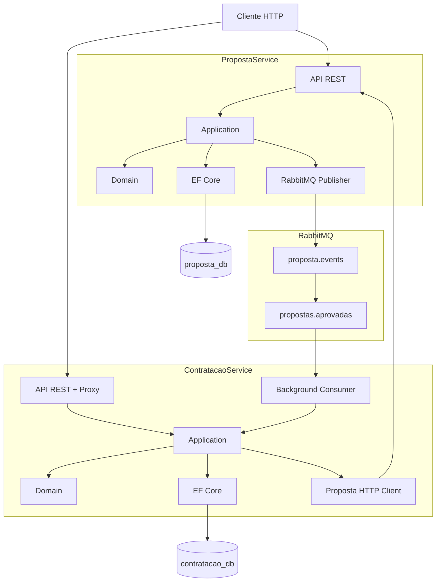

# Arquitetura — Plataforma INDT

## Visão geral

Dois microserviços independentes com bancos PostgreSQL separados e comunicação híbrida:

- **HTTP** — consultas síncronas e proxy de alteração de status
- **RabbitMQ** — eventos assíncronos após mudança de status no PropostaService



## Responsabilidades

### PropostaService

- Único serviço com **regras de negócio** de proposta
- `PATCH /api/propostas/{id}/status` é o endpoint **canônico** de alteração de status
- Publica eventos RabbitMQ **somente** após mudança de status bem-sucedida
- Criar proposta (`POST`) **não** publica na fila — status inicial `EmAnalise`

### ContratacaoService

- **Handler** consome `propostas.aprovadas` e persiste `Contratacao` (idempotente por `PropostaId`)
- **API** expõe consultas locais e **proxy HTTP** para status (sem validação local)
- **Sem** `POST /api/contratacoes` — contratação é automática via fila

## Topologia RabbitMQ

| Elemento | Valor |
|----------|-------|
| Exchange | `proposta.events` (topic, durable) |
| Routing key aprovada | `proposta.aprovada` |
| Routing key rejeitada | `proposta.rejeitada` |
| Routing key pendências | `proposta.pendencias` |
| Fila consumida | `propostas.aprovadas` (declarada pelo handler) |

O **publisher** declara apenas o exchange. Filas e bindings são responsabilidade dos **consumidores**.

## Camadas hexagonais

Cada serviço segue:

| Camada | Conteúdo |
|--------|----------|
| **Domain** | Entidades, enums, exceções de domínio |
| **Application** | Use cases, ports (interfaces), DTOs, validators |
| **Infrastructure** | EF Core, RabbitMQ, HTTP clients — implementações dos ports |
| **Api** | Controllers, DI, health checks, Swagger |

Dependências apontam sempre para dentro: Api → Infrastructure → Application → Domain.

## Transições de status

```
EmAnalise → Aprovada | Rejeitada | Pendencias
Pendencias → Aprovada | Rejeitada | Pendencias (nova observação)
Aprovada / Rejeitada → (estado final, sem alteração)
```

Pendência exige `observacao` com 10–500 caracteres (FluentValidation + domínio).

## Decisões técnicas

| Decisão | Motivo |
|---------|--------|
| RabbitMQ em vez de Kafka | Requisito do projeto, setup mais simples |
| `RabbitMQ.Client` nativo | Controle direto de exchange/filas, sem MassTransit |
| OpenTelemetry + Serilog JSON | Observabilidade vendor-neutral (Datadog, ELK, CloudWatch) |
| Dois bancos PostgreSQL | Isolamento por bounded context |
| Proxy HTTP no ContratacaoService | Cliente único de entrada sem duplicar regras |

## Trace distribuído

Propagação W3C `traceparent`:

1. Request HTTP entra no PropostaService (span ASP.NET Core)
2. Publisher injeta headers AMQP na publicação
3. Consumer extrai contexto e cria span filho `messaging.consume`

Visível em qualquer backend que aceite OTLP.
